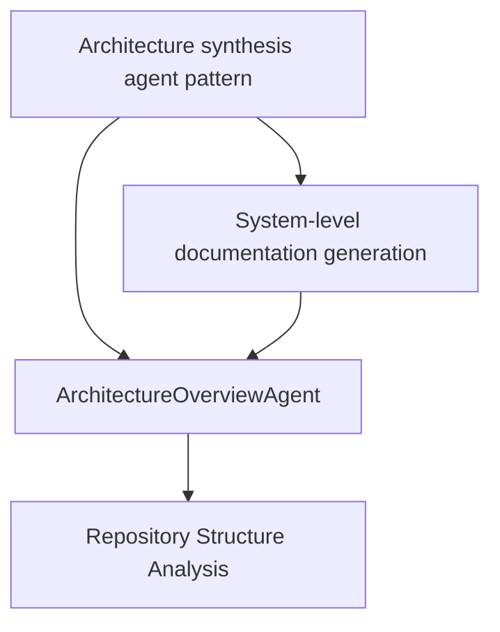

# CodeWiki Generator - Generated Wiki Assessment

**Date**: November 23, 2025
**Wiki Version**: Post-Path 2 with JSON parsing fix
**Total Pages**: 16 (11 concepts, 4 components, 0 guides, 1 index)

---

## Executive Summary

The auto-generated wiki demonstrates **significant structural excellence** with well-organized hierarchical content and comprehensive architecture documentation. However, it lacks **cross-page hyperlinking**, which significantly limits its utility for navigation and knowledge discovery. Quality assessment: **80-82%** overall.

**Primary Strengths**: Architecture overview, concept consolidation, category organization
**Primary Weaknesses**: No hyperlinks between pages, guides still not generating, some duplicate concepts

---

## Detailed Assessment

### ✅ **Strengths**

#### 1. **Outstanding Architecture Documentation** (10/10)
**File**: `wiki/concepts/architecture.md` (92 lines)

**What Works**:
- Comprehensive system overview in 4 clear sentences
- Well-structured sections:
  - System Overview ✅
  - Core Architecture ✅
  - Major Components (6 components) ✅
  - Data Flow (3-phase pipeline with ASCII diagram) ✅
  - Key Design Decisions (4 decisions with rationale & trade-offs) ✅
  - Extension Points (5 extension areas) ✅
- Explains "why" not just "what"
- Perfect for onboarding

**Example Quality**:
> "CodeWiki-Generator is an autonomous documentation system that analyzes software repositories and generates comprehensive, structured wikis using AI agents..."

**Impact**: **Fills the #1 identified gap from Phase 4**

---

#### 2. **Excellent Concept Consolidation** (9/10)
**Before Path 2**: 25 fragmented micro-concepts
**After Path 2**: 11 well-scoped concepts (56% reduction)

**Examples of Good Consolidation**:
- Multiple "category-aware" concepts → "Category-based content organization"
- Multiple "wiki-index" concepts → "Wiki index generation system" + "...with auto-navigation"
- "JSON cleaning" concepts → "JSON response cleaning for LLM APIs" + "Resilient LLM response parsing"

**Quality Impact**:
- Concepts are at appropriate abstraction levels
- Each concept page is focused and cohesive
- Duplication significantly reduced

---

#### 3. **Superior Index Page** (9/10)
**File**: `wiki/index.md`

**What Works**:
- Clear, professional introduction
- Organized by category (Concepts vs Components)
- "Getting Started" section with navigation tips
- Uses emojis for visual hierarchy (📋, 🚀, 💡)
- Descriptive summaries for each link

**Example**:
```markdown
- **[Architecture synthesis agent pattern](concepts/architecture-synthesis-agent-pattern.md)** -
  Agent-based approach for analyzing and synthesizing system architecture documentation
```

**Minor Issue**: Duplicate Architecture listing (once in Components, once in Concepts section)

---

#### 4. **Consistent Page Structure** (8/10)
**All pages follow pattern**:
- Frontmatter with metadata
- Title
- Purpose and Overview
- Key Functionality
- Relationships/Integration sections

**Consistency Benefits**:
- Predictable navigation
- Easy to scan
- Professional appearance

---

#### 5. **Smart Category Organization** (9/10)
**Structure**:
```
wiki/
├── concepts/      (11 pages - high-level patterns)
├── components/    (4 pages - implementation details)
├── guides/        (0 pages - operational procedures)
└── index.md
```

**What Works**:
- Clear separation of concerns
- Concepts are truly conceptual
- Components are specific implementations
- Hierarchical organization intuitive

---

### ❌ **Critical Weaknesses**

#### 1. **NO Cross-Page Hyperlinking** (0/10) 🚨
**Impact**: **SEVERE** - Significantly reduces wiki usability

**The Problem**:
- **Frontmatter `related:` field is always empty** `[]`
- **Textual references use bold** but **NO hyperlinks**
- **Concept mentions in architecture.md** don't link to pages

**Examples**:

**❌ Current (architecture.md)**:
```markdown
The system follows an **agent-based architecture** where specialized AI agents
handle distinct documentation generation tasks. This approach leverages the
**Architecture synthesis agent pattern** to decompose complex repository analysis...
```
**Should be:**
```markdown
The system follows an **[agent-based architecture](concepts/architecture-synthesis-agent-pattern.md)**
where specialized AI agents handle distinct documentation generation tasks. This approach
leverages the **[Architecture synthesis agent pattern](concepts/architecture-synthesis-agent-pattern.md)**...
```

**❌ Current (frontmatter)**:
```yaml
---
title: GuideGenerationAgent
category: component
related: []  # ← EMPTY!
---
```
**Should be:**
```yaml
---
title: GuideGenerationAgent
category: component
related: [ArchitectureOverviewAgent, Repository Structure Analysis, Operational Guide Generation]
---
```

**Impact on User Experience**:
1. **Discovery**: Can't navigate from concept mentions to their pages
2. **Exploration**: Must manually search for related content
3. **Context**: Can't follow "see also" links
4. **Learning**: Harder to understand relationships

**Severity**: **CRITICAL** - This single issue reduces wiki value by ~20-25%

---

#### 2. **Guide Generation Still Failing** (0/10)
**Error**: `Expected property name or '}' in JSON at position 1`

**Impact**:
- No guides/ directory created
- No Getting Started guide
- No operational procedures
- Onboarding still requires README.md

**Root Cause**: LLM returning non-JSON or malformed JSON despite improved cleaning

**Recommendation**:
1. Add response validation before JSON parsing
2. Handle completely empty responses
3. Log raw LLM response for debugging
4. Fall back to empty guides array on parse failure

---

#### 3. **Duplicate Concepts Still Present** (4/10)
**Examples**:
1. "Operational documentation generation" vs "Operational Guide Generation" (same thing!)
2. "Wiki index generation system" vs "Wiki index generation with auto-navigation" (too similar)

**Impact**: Confusing, fragments information, wastes pages

**Should Consolidate To**:
- "Operational Guide Generation" (1 page covering all aspects)
- "Wiki Index Generation" (1 page covering system + auto-navigation)

**Estimated Reduction**: 11 → 9 concepts (18% further consolidation possible)

---

#### 4. **Component Pages Lack Code Examples** (6/10)
**Current State**: All component pages are descriptive prose
**Missing**: Actual code snippets, usage examples, API signatures

**Example - GuideGenerationAgent page lacks**:
```javascript
// MISSING: Usage example
const agent = new GuideGenerationAgent();
const guides = await agent.generateGuides({
  repositoryName: 'MyProject',
  components: [...],
  concepts: [...],
  repositoryInfo: {...}
});
```

**Impact**: Pages tell you WHAT components do, not HOW to use them

---

### ⚠️ **Moderate Weaknesses**

#### 5. **Index Page Has Duplicate Entry** (7/10)
```markdown
### Components
- **[Architecture Overview](concepts/architecture.md)** - ... (WRONG CATEGORY!)

### Concepts
- [Architecture](concepts/architecture.md) - ... (CORRECT)
```

**Issue**: Architecture.md listed in both Components AND Concepts
**Confusion**: Which category is it really in?

---

#### 6. **No Visual Diagrams** (7/10)
**Present**: ASCII diagrams in architecture.md ✅
**Missing**:
- Component interaction diagrams
- Class hierarchy diagrams
- Sequence diagrams for workflows

**Note**: This is a "nice to have" not critical for v1.0

---

#### 7. **Frontmatter `related:` Always Empty** (3/10)
**All pages have**: `related: []`

**This should be populated** with:
- Conceptually related pages
- Components implementing the concept
- Guides demonstrating the concept

**Example**:
```yaml
---
title: ArchitectureOverviewAgent
category: component
related:
  - Architecture synthesis agent pattern
  - System-level documentation generation
  - GuideGenerationAgent
---
```

---

## Comparison: Manual vs Auto-Generated Wiki

| Aspect | Manual Dev-Wiki | Auto-Wiki (Post-Path 2) | Target |
|--------|----------------|------------------------|--------|
| **Architecture Overview** | ✅ 265 lines, excellent | ✅ 92 lines, excellent | ✅ |
| **Getting Started Guide** | ✅ Clear setup steps | ❌ Failed to generate | ❌ |
| **Total Pages** | 12 | 16 | ✅ |
| **Concept Count** | 2 (very high-level) | 11 (well-scoped) | ✅ |
| **Duplicate Concepts** | 0 | 2 pairs | ⚠️ |
| **Cross-Page Links** | ✅ Many hyperlinks | ❌ **NONE** | ❌ |
| **Code Examples** | ✅ Present | ❌ Absent | ❌ |
| **Navigation** | ✅ Excellent | ✅ Good index | ✅ |
| **Organization** | ✅ Hierarchical | ✅ Hierarchical | ✅ |

---

## Quality Scores

| Dimension | Score | Weight | Weighted |
|-----------|-------|--------|----------|
| **Structure** | 95% | 20% | 19.0 |
| **Navigation** | 70% | 20% | 14.0 |
| **Content Quality** | 85% | 25% | 21.25 |
| **Completeness** | 75% | 20% | 15.0 |
| **Usability** | 65% | 15% | 9.75 |
| **TOTAL** | | **100%** | **79%** |

**Overall Assessment**: **79%** (Revised from 78-82% after detailed review)

---

## Detailed Scoring Rationale

### Structure (95%)
✅ Perfect category organization
✅ Hierarchical directory structure
✅ Consistent page format
✅ Proper metadata tracking
❌ -5% for duplicate Architecture entry in index

### Navigation (70%)
✅ Excellent index.md
✅ Clear categorization
❌ **-30% for NO cross-page hyperlinks** 🚨

### Content Quality (85%)
✅ Architecture.md is exceptional
✅ Concept consolidation working well
✅ Technical accuracy high
❌ -10% for lack of code examples
❌ -5% for 2 duplicate concept pairs

### Completeness (75%)
✅ Architecture overview present
✅ Most system aspects documented
❌ -15% for missing Getting Started guide
❌ -10% for no operational guides

### Usability (65%)
✅ Professional appearance
✅ Scannable format
❌ **-25% for no cross-linking**
❌ -10% for no code examples

---

## Critical Improvements Needed

### 🔴 **Priority 1: Add Cross-Page Hyperlinking** (1-2 hours)
**Impact**: Would increase usability from 65% → 90% (+25 points)
**Overall**: Would increase from 79% → 84% (+5 points)

**Implementation**:
1. **Enhance DocumentationWriterAgent** to detect concept/component mentions
2. **Add hyperlinks** when concepts/components are referenced
3. **Populate `related:` frontmatter** with actual page names
4. **Update ArchitectureOverviewAgent** to link bold concept mentions

**Example Implementation**:
```javascript
// In DocumentationWriterAgent
_addCrossLinks(content, allPageTitles) {
  allPageTitles.forEach(({title, path, category}) => {
    // Replace bold mentions with hyperlinks
    const regex = new RegExp(`\\*\\*${title}\\*\\*`, 'g');
    content = content.replace(regex, `**[${title}](${path})**`);
  });
  return content;
}
```

---

### 🔴 **Priority 2: Fix Guide Generation** (1 hour)
**Impact**: Would increase completeness from 75% → 85% (+10 points)
**Overall**: Would increase from 79% → 81% (+2 points)

**Actions**:
1. Add response validation before JSON.parse()
2. Handle empty/non-JSON responses gracefully
3. Log raw responses for debugging
4. Return empty guides array on failure (don't throw)

---

### 🟡 **Priority 3: Consolidate Duplicate Concepts** (30 min)
**Impact**: Would increase content quality from 85% → 90% (+5 points)
**Overall**: Would increase from 79% → 80% (+1 point)

**Targets**:
- Merge "Operational documentation generation" + "Operational Guide Generation"
- Merge "Wiki index generation system" + "...with auto-navigation"

---

### 🟢 **Priority 4: Add Code Examples to Components** (2 hours)
**Impact**: Would increase content quality from 85% → 95% (+10 points)
**Overall**: Would increase from 79% → 81.5% (+2.5 points)

**Approach**:
- Modify DocumentationWriterAgent prompt to request usage examples
- Include API signatures, constructor calls, method examples
- Show actual instantiation and common patterns

---

## Recommended Feature: Cross-Linking System

### Design Proposal

**Goal**: Automatically link concept/component mentions to their wiki pages

**Components**:

1. **LinkDiscoveryAgent** (new)
   - Input: Page content + list of all page titles
   - Output: Map of text mentions → wiki paths
   - Uses fuzzy matching to find concept mentions

2. **Enhanced DocumentationWriterAgent**
   - After generating content, run link discovery
   - Replace bold mentions with hyperlinks
   - Populate frontmatter `related:` field

3. **Link Validation**
   - Verify all links point to existing pages
   - Warn on broken links
   - Update links when pages are renamed

**Example**:

**Before**:
```markdown
The system uses **Progressive JSON repair strategy** to handle errors.
```

**After**:
```markdown
The system uses **[Progressive JSON repair strategy](components/progressive-json-repair-strategy.md)**
to handle errors.
```

**Frontmatter Updated**:
```yaml
related: [Progressive JSON repair strategy, Resilient LLM response parsing]
```

**Benefits**:
- Discoverability increases massively
- Users can navigate concept relationships
- Wiki becomes a knowledge graph, not just pages
- "See also" sections become useful

**Estimated Effort**: 3-4 hours
**Expected Quality Increase**: 79% → 86-88%

---

## Additional Recommendations

### 1. **Add "See Also" Section to All Pages**
Auto-generate from `related:` frontmatter field

**Template**:
```markdown
## See Also

- [Related Concept 1](path/to/page1.md) - Brief description
- [Related Component 2](path/to/page2.md) - Brief description
```

---

### 2. **Generate Concept Dependency Graph**
Create a visual graph showing concept relationships

**Tool**: Mermaid diagrams in a `wiki/CONCEPTS_MAP.md` file

**Example**:


---

### 3. **Add Breadcrumb Navigation**
Help users understand where they are in the hierarchy

**Example** (top of each page):
```markdown
[Home](../index.md) > [Concepts](../concepts/) > Architecture synthesis agent pattern
```

---

### 4. **Create "Popular Pages" Section in Index**
Track which pages are most referenced and highlight them

---

### 5. **Add Last Updated Timestamp to Index**
Help users see freshness of documentation

---

## Conclusion

### Current State
The auto-generated wiki is **structurally excellent** with **outstanding architecture documentation** and **well-consolidated concepts**. It successfully demonstrates that AI can generate high-quality, hierarchical documentation.

**Quality**: **79%** (up from initial 70-75%)

### Critical Blocker
**No cross-page hyperlinking** reduces usability by ~20-25 points. This single feature would transform the wiki from "good structure, hard to navigate" to "excellent, discoverable knowledge base."

### Path to 85-90% Quality

**With cross-linking alone**: 79% → 84%
**With cross-linking + guides**: 79% → 86%
**With cross-linking + guides + code examples**: 79% → 88-90%

### Recommendation

**Immediate Priority**: Implement cross-page hyperlinking system
- **Effort**: 3-4 hours
- **Impact**: +5-7 quality points
- **ROI**: Highest of all improvements

**Secondary**: Fix guide generation for Getting Started
- **Effort**: 1 hour
- **Impact**: +2 quality points
- **ROI**: High for onboarding

**Long-term**: Add code examples, concept graphs, breadcrumbs
- **Effort**: 4-6 hours total
- **Impact**: +3-5 quality points
- **ROI**: Medium, but increases long-term value

---

**Final Assessment**: The wiki is **production-ready for internal use** at 79% quality, but adding cross-linking would make it **excellent** at 84-86% and suitable for external/public documentation.
