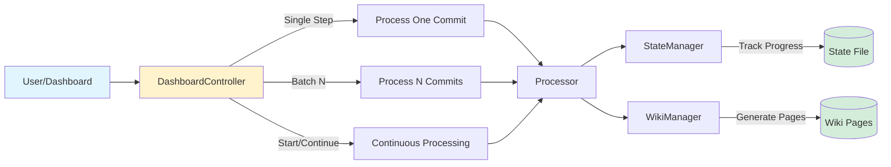

[Home](../index.md) > [Concepts](../concepts) > Step Wise Processing Control

## Table of Contents

- [See Also](#see-also)

<h1>Step-wise Processing Control</h1>
<h2>Purpose and Overview</h2>

The Step-wise processing control provides granular management capabilities for wiki generation processes through a web dashboard interface. It enables users to control repository processing at different levels - from single commits to full batch operations - allowing for debugging, cost management, and precise control over the wiki generation workflow.

<h2>Key Functionality</h2>

The <code>[DashboardController](../components/dashboard-controller.md)</code> class serves as the primary interface for processing control, offering:

<ul>
<li><strong>Processing Management</strong>: Start, pause, and monitor wiki generation processes with real-time status updates</li>
<li><strong>Granular Control</strong>: Process individual commits or specified batch sizes for debugging and incremental progress</li>
<li><strong>Web Interface</strong>: Renders dashboard views and serves generated wiki pages through HTTP endpoints</li>
<li><strong>API Endpoints</strong>: Provides JSON responses for status monitoring and programmatic control</li>
<li><strong>URL Validation</strong>: Validates GitHub repository URLs before processing begins</li>
</ul>

The controller supports both automated batch processing for efficiency and step-by-step processing for careful monitoring and debugging scenarios.

<h2>Relationships</h2>

The Step-wise processing control acts as an orchestration layer that coordinates multiple core components:

<ul>
<li><strong>Processor</strong>: Manages the actual repository analysis and wiki generation logic</li>
<li><strong>StateManager</strong>: Tracks processing state, progress, and current position in commit history</li>
<li><strong>WikiManager</strong>: Handles wiki page generation and content management</li>
<li><strong>Web Interface Layer</strong>: Provides the user-facing dashboard above the core processing system</li>
</ul>

<h2>Usage Example</h2>
<pre><code class="language-javascript">const [DashboardController](../components/dashboard-controller.md) = require(&#39;./lib/dashboard-controller&#39;);

// Initialize dashboard controller
const dashboard = new [DashboardController](../components/dashboard-controller.md)();

// Start processing a repository
await dashboard.startProcessing({
  url: &#39;https://github.com/user/repository&#39;
});

// Process a single step for debugging
await dashboard.processStep();

// Process multiple commits in batch
await dashboard.processBatch({ count: 10 });

// Check current status
const status = await dashboard.getStatus();
</code></pre>
<h2>Testing</h2>

No automated tests found for this component. Testing coverage should be implemented to verify processing control flows, state management, and error handling scenarios.

## See Also

**Project Context:**
- [Core Philosophy & Vision](../meta/philosophy.md)
- [Technical Specification](../meta/specification.md)
- [Project History and Achievement Analysis](../history/progress-report.md)

**Related Topics:**
- [DashboardController](../components/dashboard-controller.md)
- [architecture](../concepts/architecture.md)
