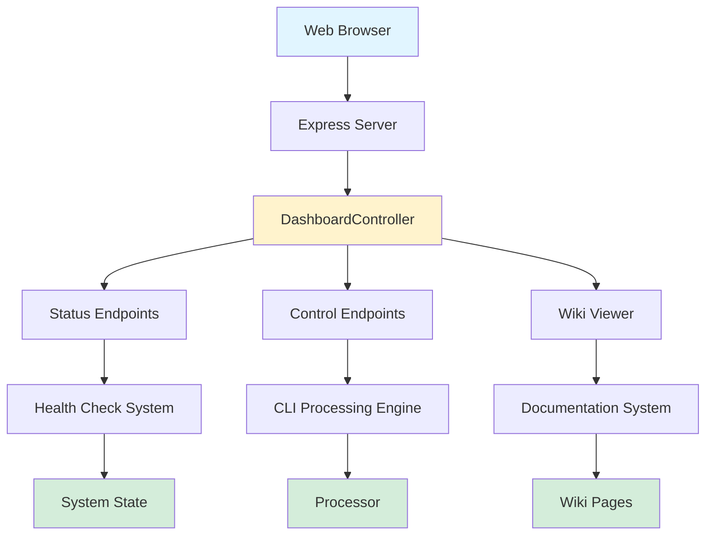

[Home](../index.md) > [Concepts](../concepts) > Web Dashboard Architecture

## Table of Contents

- [See Also](#see-also)

<h1>Web Dashboard Architecture</h1>
<h2>Purpose and Overview</h2>

The Web Dashboard Architecture transforms the application from a CLI-only system into a web-accessible interface, providing centralized monitoring and control capabilities through a browser. This [architecture](../concepts/architecture.md) implements a comprehensive dashboard that integrates system status reporting, processing control, and documentation viewing into a single web interface.

<h2>Key Functionality</h2>

The dashboard provides several core capabilities:

<ul>
<li><strong>System Monitoring</strong>: Real-time status reporting through API endpoints that display current system state and health metrics</li>
<li><strong>Processing Control</strong>: Web-based controls for starting, pausing, stepping through, and batch processing operations that were previously only available via CLI</li>
<li><strong><a href="../components/wiki-integration.md">[Wiki Integration](../components/wiki-integration.md)</a></strong>: Seamless viewing of documentation and wiki content through nested URL patterns like <code>/wiki/concepts/[architecture](../concepts/architecture.md)</code></li>
<li><strong>Dashboard Interface</strong>: A centralized web UI that consolidates all system operations and information into an accessible format</li>
</ul>

The <code>[DashboardController](../components/dashboard-controller.md)</code> class serves as the primary orchestrator, handling HTTP routes and business logic for all dashboard operations. The [architecture](../concepts/architecture.md) supports both interactive dashboard rendering and API endpoints for programmatic access.

<h2>Relationships</h2>

The Web Dashboard Architecture integrates with several existing system components:

<ul>
<li><strong>Health Check System</strong>: Builds upon existing health monitoring endpoints to provide web-accessible status information</li>
<li><strong>CLI Processing Engine</strong>: Exposes existing CLI functionality through web endpoints, maintaining the same underlying processing logic</li>
<li><strong>Documentation System</strong>: Connects the wiki and documentation viewing capabilities directly within the dashboard interface</li>
<li><strong>Express Server Infrastructure</strong>: Utilizes the established server framework with additional middleware for dashboard-specific routing and static file serving</li>
</ul>

<h2>Usage Example</h2>
<pre><code class="language-javascript">const express = require(&#39;express&#39;);
const [DashboardController](../components/dashboard-controller.md) = require(&#39;./server&#39;);

// Initialize dashboard with Express app
const app = express();
const dashboard = new [DashboardController](../components/dashboard-controller.md)(app);

// Access dashboard endpoints
app.get(&#39;/&#39;, dashboard.renderDashboard);
app.get(&#39;/api/status&#39;, dashboard.getStatus);
app.post(&#39;/api/start&#39;, dashboard.startProcessing);
</code></pre>
<h2>Testing</h2>

<strong>Test Coverage</strong>: Comprehensive integration testing in <code>tests/integration/server.test.js</code>

<ul>
<li><strong>11 test cases</strong> across <strong>6 test suites</strong></li>
<li><strong>Test Categories</strong>: Express Server [configuration](../guides/configuration.md), Health Check endpoints, Static File Serving, View Engine setup, Error Handling, and Middleware [Configuration](../guides/configuration.md)</li>
<li>Tests ensure proper server initialization, route handling, and integration between dashboard components and existing system infrastructure</li>
</ul>

## See Also

**Project Context:**
- [Core Philosophy & Vision](../meta/philosophy.md)
- [Technical Specification](../meta/specification.md)
- [Project History and Achievement Analysis](../history/progress-report.md)

**Related Topics:**
- [DashboardController](../components/dashboard-controller.md)
- [Wiki Integration](../components/wiki-integration.md)
