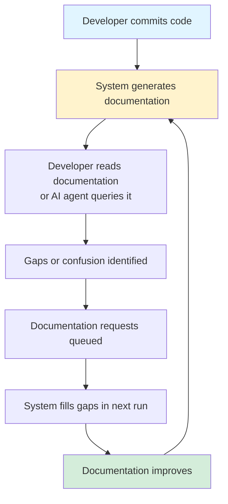

[Home](../index.md) > [Meta](../meta) > Philosophy

## Table of Contents

- [See Also](#see-also)

<h1>Core Philosophy &amp; Vision</h1>
<h2>The Central Insight</h2>
<blockquote>

<strong>Code tells you what. Documentation tells you why. History tells you how.</strong>

</blockquote>

Most documentation systems fail because they&#39;re written once, never updated, separate from the code they describe, created after the fact missing context, and expensive to maintain.

But what if documentation could <strong>grow organically</strong> alongside code? What if understanding a codebase was like watching a time-lapse of its construction, seeing not just the final building but every brick laid in order?

<h2>The Vision</h2>
<h3>Archaeological Documentation</h3>

A system that walks through git history chronologically and builds a living wiki that captures:

<ul>
<li><strong>Concepts</strong>: The mental models and abstractions</li>
<li><strong>Components</strong>: The actual code structures  </li>
<li><strong>Relationships</strong>: How pieces connect</li>
<li><strong>Evolution</strong>: How understanding deepened over time</li>
</ul>

The wiki isn&#39;t just a static snapshot—it&#39;s <strong>archaeological documentation</strong>. You can see when concepts were introduced, when they changed, when they were refined. The documentation carries the story of the codebase&#39;s intellectual development.

<h3>For Developers</h3>

Imagine opening an unfamiliar codebase and asking:

<ul>
<li>&quot;How does authentication work?&quot; → Wiki has a clear page</li>
<li>&quot;Where are tests configured?&quot; → <a href="guides/[testing-approach](../guides/testing-approach.md).md">Testing guide</a> exists</li>
<li>&quot;Why was this approach chosen?&quot; → History shows the decision point</li>
</ul>

The wiki becomes your <strong>external brain</strong> for the codebase. It&#39;s always current because it&#39;s regenerated from history. It&#39;s always consistent because it&#39;s generated by the same AI understanding the patterns.

<h3>For AI Coding Agents</h3>

Current problem: AI agents get a massive context dump of code and struggle to find relevant information.

With CodeWiki:

<ul>
<li>Agent queries: &quot;How do I run tests?&quot;</li>
<li>MCP server returns the exact wiki page documenting test setup</li>
<li>Agent has perfect context, not overwhelming context</li>
</ul>

The wiki acts as a <strong>compressed, indexed, structured knowledge base</strong>—optimized for retrieval, not raw code dumping.

<h2>Core Philosophy</h2>
<h3>1. Documentation as Emergent Property</h3>

Good documentation emerges from understanding, not from exhaustive cataloging. The system starts simple:

<ul>
<li>First pass: &quot;This file handles authentication&quot;</li>
<li>Later: &quot;This is OAuth2 with refresh token rotation&quot;</li>
<li>Even later: &quot;This implements RFC 6749 with custom security extensions&quot;</li>
</ul>

Understanding deepens naturally as the system processes more commits. Just like a human learning a codebase.

<h3>2. Organic Growth, Not Comprehensive Coverage</h3>

Not everything deserves documentation. A wiki page should exist because it&#39;s <strong>useful</strong>, not because it&#39;s <strong>complete</strong>.

<ul>
<li>Important code gets referenced repeatedly → Gets detailed documentation</li>
<li>Peripheral utilities mentioned once → Gets a brief note</li>
<li>Boring config files → Might be ignored entirely</li>
</ul>

The system discovers what matters by seeing what&#39;s significant in commits and what other code depends on.

<h3>3. Self-Limiting Complexity</h3>

Wikis naturally stay manageable because verbosity is a bug, not a feature. If a page grows too long, it becomes less useful, signaling the need to split it. If pages have redundant content, consolidation improves quality.

The medium itself enforces good practices. You can&#39;t have a 10,000-word wiki page without noticing something&#39;s wrong.

<h3>4. The Documentation as Truth Test</h3>
<blockquote>

<strong>If you build a documentation system that documents itself poorly, the system is broken.</strong>

</blockquote>

This project practices radical self-reference:

<ul>
<li>The system documents codebases by analyzing git history</li>
<li>The system&#39;s own git history is its test case</li>
<li>If you can&#39;t understand this codebase from its own generated wiki, the documentation system has failed</li>
<li>Fix the system until its self-documentation is excellent</li>
</ul>

This creates a virtuous feedback loop: improving the documentation system improves its ability to document itself, which reveals new ways to improve the system.

<h2>The Feedback Loop</h2>

The system <strong>learns what documentation is needed</strong> by observing what gets requested.

<h2>Unique Aspects</h2>
<h3>Time as a Feature, Not a Bug</h3>

Most documentation tries to hide history (&quot;Here&#39;s how it works now&quot;). This system <strong>embraces history</strong> (&quot;Here&#39;s how understanding evolved&quot;).

Seeing that &quot;UserManager&quot; became &quot;AuthenticationService&quot; at commit 147 tells you something valuable about the <a href="concepts/[architecture](../concepts/architecture.md).md">[architecture](../concepts/architecture.md)&#39;s</a> maturation.

<h3>Human + AI Collaboration</h3>

The system isn&#39;t fully autonomous or fully manual:

<ul>
<li>AI handles bulk processing (generates docs from commits)</li>
<li>Humans handle judgment calls (this is important, that isn&#39;t)</li>
<li>Meta-analysis agent proposes improvements</li>
<li>Humans approve or reject</li>
<li>Humans can edit wiki pages directly</li>
<li>AI learns from human edits</li>
</ul>

It&#39;s a <strong>pair programming model</strong> for documentation.

<h3>Documentation That Documents Its Own Quality</h3>
<ul>
<li>Normal documentation: silent about its coverage or accuracy</li>
<li>CodeWiki: knows which pages are well-linked (probably important), which are orphaned (maybe obsolete), which get frequently requested (need improvement)</li>
</ul>

The <strong>metadata about documentation</strong> is itself valuable information.

<h2>Key Principles</h2>
<h3>Start Minimal, Grow Organically</h3>

Don&#39;t try to document everything on day one. Let importance reveal itself through repeated references and usage patterns.

<h3>Embrace Imperfection</h3>

Early documentation will be rough. That&#39;s fine—it improves with each pass. Stale is worse than imperfect.

<h3>Trust the Medium</h3>

Wikis have survived decades because the format works. Internal linking, simple markup, human readability—don&#39;t fight the medium.

<h3>Make It Useful First, Complete Later</h3>

A single excellent page about authentication is more valuable than 50 mediocre pages cataloging every function.

<h3>The System Should Love Being Used On Itself</h3>

If building this system makes you avoid using it on itself, something is wrong. The best validation is dogfooding.

<h2>Design Philosophy</h2>
<h3>For Humans</h3>
<ul>
<li><a href="components/dashboard-control-interface.md">Dashboard</a> shows exactly what&#39;s happening (no black box)</li>
<li>Manual stepping lets you verify before trusting</li>
<li>Edit pages directly when AI gets it wrong</li>
<li>Controls are simple: start, pause, step</li>
</ul>
<h3>For AI Agents</h3>
<ul>
<li>Small, focused tasks (analyze one file, write one page)</li>
<li>Structured inputs and outputs (JSON for agent-to-agent communication)</li>
<li>Clear context boundaries (max 3 related pages, truncated diffs)</li>
<li>Feedback mechanisms (request queue for missing info)</li>
</ul>
<h3>For the System Itself</h3>
<ul>
<li>Test-driven development proves it works</li>
<li>Self-documentation proves it&#39;s useful</li>
<li>Git commits provide audit trail</li>
<li>Modularity allows improvements without rewrites</li>
</ul>
<h2>What This Isn&#39;t</h2>
<ul>
<li><strong>Not a code search engine</strong>: Wiki is curated understanding, not indexed raw code</li>
<li><strong>Not a replacement for human docs</strong>: Critical guides still need human writing</li>
<li><strong>Not comprehensive</strong>: Deliberately selective about what to document</li>
<li><strong>Not real-time</strong>: Documentation is generated, not live-updated</li>
<li><strong>Not a silver bullet</strong>: Good [architecture](../concepts/architecture.md) documentation still requires architectural thinking</li>
</ul>
<h2>What This Is</h2>
<ul>
<li><strong>A time machine for understanding</strong>: See how code evolved, not just its current state</li>
<li><strong>A knowledge compressor</strong>: Turns 100,000 lines of code into 50 pages of insight</li>
<li><strong>A collaboration tool</strong>: Human judgment + AI processing = better than either alone</li>
<li><strong>A self-improving system</strong>: Quality feedback improves future documentation</li>
<li><strong>An experiment in meta-software</strong>: Can software that documents software document itself well?</li>
</ul>
<h2>Success Metrics</h2>

You open this system&#39;s codebase for the first time. You read the generated wiki for 15 minutes. You now understand:

<ul>
<li>The overall <a href="concepts/[architecture](../concepts/architecture.md).md">[architecture](../concepts/architecture.md)</a></li>
<li>Where each major component lives</li>
<li>How to <a href="guides/[testing-approach](../guides/testing-approach.md).md">run and test</a> it</li>
<li>Why key decisions were made</li>
</ul>

You start using Claude Code with the MCP server. It asks intelligent questions because it has perfect context from the wiki. You make a change. The wiki updates. The AI agent uses the updated wiki. The loop closes.

<h2>The Meta-Question</h2>
<blockquote>

<strong>Can a system that generates understanding generate understanding of itself?</strong>

</blockquote>

If yes, we&#39;ve created something genuinely useful—a documentation tool that proves its value by documenting itself excellently.

If no, we learn exactly where AI-generated documentation fails by seeing it fail on the ideal test case (itself).

Either outcome teaches us something profound about documentation, understanding, and AI capabilities.

<h2>Core Beliefs</h2>
<ul>
<li><strong>Good documentation is like good teaching</strong>—it meets learners where they are and guides them to understanding</li>
<li><strong>This system learns to teach by teaching itself</strong></li>
<li><strong>Understanding codebases should feel less like archaeology and more like having a knowledgeable guide</strong></li>
</ul>

<em>This is not just a tool. It&#39;s an exploration of whether machines can help us understand complexity—starting with helping us understand themselves.</em>

<h2>Getting Started</h2>

For implementation details, see the <a href="guides/[getting-started](../guides/getting-started.md).md">Getting Started Guide</a> and <a href="guides/[development-workflow](../guides/development-workflow.md).md">Development Workflow</a>.

For understanding how this philosophy translates to code, explore the <a href="concepts/[architecture](../concepts/architecture.md).md">[Architecture](../concepts/architecture.md)</a> and <a href="components/wiki-integration.md">[Wiki Integration](../components/wiki-integration.md)</a> components.

## See Also

**Implementation:**
- [Dashboard Control Interface](../components/dashboard-control-interface.md)
- [DashboardController](../components/dashboard-controller.md)
- [Express web interface for documentation management](../components/express-web-interface-for-documentation-management.md)

**Related Topics:**
- [Wiki Integration](../components/wiki-integration.md)
- [Technical Specification](../meta/specification.md)
